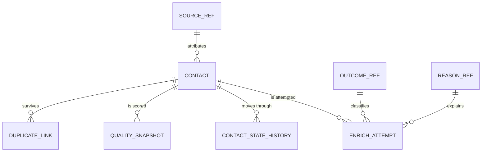

# The ERD And The Semantic Hand-Off

Whoever builds the semantic model does not read the application's code. They read the structure, the relationships, and the definitions. This file is what that hand-off looks like, so a model can be built from the documentation without a meeting to decode it.

Five artifacts, all metadata only, never row data:

1. the confirmed analytics question set with its trace, from `question-set.md`;
2. the complete data structure: tables, columns, types, nullability, defaults, keys, foreign keys, indexes;
3. the entity relationships: parent, child, cardinality, optionality, join key;
4. the ERD;
5. the semantic hand-off: grain per table, measure catalog, dimension catalog, hierarchies, and one agreed definition per measure.

Where they live is a confirmed fact recorded in `.claude/PROJECT-CONTEXT.md`. The default home is the knowledge base per `.claude/rules/knowledge-base.md`, with column-level metadata in the table dictionary. Durable write-ups wait for the approval gate; metadata describing an actual schema change travels in the same change unit as that change.

Every name in these artifacts is a name Schema MCP confirmed in the current session. Nothing here is a place to write a column you expect to exist.

## The Data Structure

One block per table, its grain sentence first.

```text
Table: <schema>.<table>
Grain: one row is one <thing>.
Purpose: <one line>
Classification: <per .claude/rules/data-governance.md>
Retention: <confirmed period>
```

| Column | Type | Null | Default | Key | Role | Notes |
| --- | --- | --- | --- | --- | --- | --- |
| key column | per convention | no | system | PK | key | Stable, never reused |
| a reference key | per convention | no | unknown member | FK | dimension key | Points at the shared reference set |
| an amount | exact decimal | no | 0 | | measure, additive, currency | Unit stated |
| an event time | timestamp with zone | no | | | business date, primary | Not the audit column |
| an audit time | timestamp with zone | no | system | | audit | Never used as the business date |

Role is the column that makes this document useful to a model builder: key, dimension key, dimension attribute, measure, business date, audit, scope, row reference, evidence.

## Entity Relationships

| Parent | Child | Cardinality | Optional | Join key | On parent delete |
| --- | --- | --- | --- | --- | --- |
| contact | enrichment attempt | one to many | yes, a contact may have none | contact key | restrict, attempts are history |
| source reference set | contact | one to many | no, unknown member is used | source key | restrict |
| contact (survivor) | duplicate link | one to many | yes | survivor key | restrict |

State the optionality in words, not just a symbol. "A contact may have no attempts" is the sentence that tells a model builder an inner join would lose contacts, which is exactly the mistake that turns "how many contacts" into "how many contacts we tried to enrich".

## The ERD

Keep the diagram as text in the repository when the project has no confirmed diagram tool, so it lives beside the code, diffs in review, and cannot drift into a stale image nobody can edit. Mermaid renders in most Markdown viewers:



When the project confirms a diagram tool or a modeling product, use that instead and record where the file lives. Either way the diagram shows every table in the change, its relationships, and their cardinality. A diagram that omits the history and reference tables hides the half of the model that answers the questions.

## The Semantic Hand-Off

### Fact Inventory

| Table | Grain | Primary business date | Other dates and roles | Scope columns |
| --- | --- | --- | --- | --- |
| contact | one contact | created at | enriched at, converted at | owner, business unit |
| enrichment attempt | one attempt on one contact | started at | ended at | owner, business unit |

### Measure Catalog

| Measure | Source | Unit | Default aggregation | Additivity | Definition | Answers |
| --- | --- | --- | --- | --- | --- | --- |
| Contacts received | row count of contact | count | sum | additive | A contact row that is not soft-deleted, counted by its created date | How many arrived, by source, by month |
| Enrichment attempts | row count of attempt | count | sum | additive | One attempt at the enrichment step, including retries | How many attempts were made |
| Enrichment successes | attempts with outcome succeeded | count | sum | additive | An attempt whose outcome code is succeeded | How many enriched |
| Enrichment failures | attempts with outcome failed | count | sum | additive | An attempt whose outcome code is failed, grouped by reason | How many failed to enrich, and why |
| Enrichment success rate | successes over attempts | percent | computed | non-additive | Successes divided by attempts; both parts stored, never the rate | How reliable enrichment is |
| Time to enrich | ended at minus started at | minutes | average | non-additive | Derived from the attempt endpoints of the successful attempt | How long enrichment takes |

Every row of this table is a sentence the business agreed to. That is the point of the definition column: two people counting "enriched contacts" differently is the most common reporting dispute there is, and it is settled here, once, rather than per report.

### Dimension Catalog

| Dimension | Code column | Label column | Conformed | Hierarchy | Reserved members |
| --- | --- | --- | --- | --- | --- |
| Source | source code | source label | yes, platform-wide | channel to source | unknown, other |
| Attempt outcome | outcome code | outcome label | yes, shared by all steps | none | none |
| Failure reason | reason code | reason label | yes, shared by all steps | class to reason | not applicable |
| Owner | user key | display name | yes | user to team to business unit | unassigned |

Mark each dimension conformed or local, and say which existing platform set it is. That single column is what tells the reporting owner whether contacts and leads can be reported by one source list, which is the difference between a platform-wide model and a set of per-feature models that cannot be joined.

### Hierarchies

State the level order and whether a level may be skipped:

```text
Date:  date -> month -> quarter -> year (fiscal year start: confirmed fact)
Org:   user -> team -> business unit -> organization (a user may sit directly on a business unit)
```

## Review Before Hand-Off

- Every confirmed question traces to a measure or dimension in these tables, and every gap is named.
- Every table has a grain sentence, and no two tables in the diagram share one.
- Every measure has a unit, a default aggregation, an additivity, and a definition in words.
- Every dimension key on a fact is non-null with a real foreign key, and reserved members exist where rows are counted.
- Every relationship states cardinality and optionality in words.
- Every name was verified live through Schema MCP this session.
- No row data, customer record, or PII appears anywhere in the artifacts.

## Never

- Ship a structure document without grain sentences, or a measure without a definition.
- Name a table or column that Schema MCP has not confirmed.
- Leave the reference, history, and attempt tables out of the ERD.
- Paste sample rows, real names, or production values into any of these artifacts as illustration.
- Let the write-up drift from the schema. A change that alters the schema updates the metadata in the same change unit, per `.claude/rules/knowledge-base.md`.
