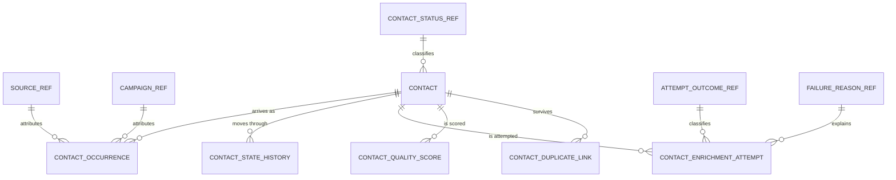

# Worked Example: Contact Management

One feature carried from the questions to the hand-off, using contact management because its analytics are familiar: how many contacts, from which source, how good they are, how many enriched, how many failed, how many are repeats.

Everything below is a concept, not an instruction to create these tables. A real project confirms the questions with the developer, runs the reuse-first search for each concept through `mcp__schema__find_existing_tables_for_concept`, verifies every name with `mcp__schema__describe_table`, shows the developer the shape with its grain and question set, and proposes only after explicit confirmation, per `.claude/rules/schema-mcp.md`.

## Step 1: The Confirmed Question Set

| Question | Answered by | Counted at | Status |
| --- | --- | --- | --- |
| How many contacts are we getting, and from which source | occurrence rows with a source key | one row per arrival | answered |
| How good are the contacts we hold, and is that improving | quality score rows with their component parts | one row per contact per scoring run | answered |
| How many contacts have been enriched | attempt rows with outcome succeeded | one row per attempt | answered |
| How many failed to enrich, and why | attempt rows with outcome failed plus a coded reason | one row per attempt | answered |
| How many contacts are recurring | occurrence count per contact, plus duplicate links across identities | one row per arrival, one row per matched pair | answered |
| How long does enrichment take | attempt start and end timestamps | one row per attempt | answered |
| How many contacts per owner and business unit | scope keys on the contact and on each event | one row per contact, per event | answered |
| Which campaign converts best | campaign is captured on arrival; conversion is not modeled in this feature | not captured | gap, raised with the developer |

Two of these came from the developer, not from the family walk: the owner question and the campaign question. The campaign gap was raised rather than quietly designed for, and the developer deferred it.

## Step 2: What The Screen-Shaped Design Would Have Cost

The design a screen alone asks for is one table: contact, with a source text field, an `is_enriched` flag, a status column, and audit timestamps. It renders every screen correctly and answers almost nothing.

| Screen-shaped choice | Question it kills |
| --- | --- |
| Source as free text | "Which source" - "Web Form", "web form", and "WebForm" are three sources |
| `is_enriched` boolean | "How many failed to enrich" - never attempted and attempted-and-failed look identical |
| Enrichment failures written to the log only | "Why did they fail" - the reasons are not queryable beside the contact |
| Status overwritten in place | "How many became qualified last month", "how long in each stage" |
| A repeat submission overwriting the existing contact | "How many are recurring" - each repeat erases the evidence of the previous one |
| Quality score overwritten on each run | "Is contact quality improving" - only today's number exists |
| Hard delete on remove | Last month's contact count changes every time somebody tidies up |

None of these is fixable later by writing a better query. The data was never captured.

## Step 3: The Structure

Reference sets first, because they are shared platform-wide and are usually already there. Search before proposing any of them, and add a member to an existing set rather than starting a new set.

| Reference set | Grain | Notes |
| --- | --- | --- |
| source | one row is one acquisition source | Conformed; contacts, leads, and campaigns group by the same list. Reserved members: unknown, other |
| contact status | one row is one contact status | Conformed with the status set the module already uses |
| attempt outcome | one row is one outcome | succeeded, failed, skipped, partial; shared by every step, not only enrichment |
| failure reason | one row is one coded reason | Carries a class (input, provider, quota, timeout) and a retryable flag |

Then the feature's own tables.

```text
Table: contact
Grain: one row is one distinct contact identity.
Holds: current state and the columns a screen needs, plus what makes the identity resolvable.
```

| Column | Role | Why it is here |
| --- | --- | --- |
| contact key | key | Stable, single column, never reused |
| match key | attribute | The normalized value matching runs on, so recurrence is repeatable and reportable |
| status key | dimension key | Current status, non-null, from the shared status set |
| owner key, business unit key | scope | Report filters and record-level scope live on the row |
| first seen at, last seen at | business dates | The identity's first and most recent arrival |
| occurrence count | measure | Maintained in the same transaction that writes an occurrence row |
| current quality score | measure | A convenience copy of the latest score row, never the record of history |
| deleted at, deleted by, delete reason key | soft delete | The row stays, so a counted contact never disappears |
| created at, updated at | audit | Never used as a business date |

```text
Table: contact occurrence
Grain: one row is one arrival of contact data for one contact identity.
Holds: the acquisition event, which is what volume and source questions actually count.
```

| Column | Role | Why it is here |
| --- | --- | --- |
| occurrence key | key | |
| contact key | FK | The identity this arrival belongs to |
| source key | dimension key | Non-null, unknown member where the source was not supplied |
| campaign key | dimension key | Captured now even though conversion is deferred |
| arrived at | business date, primary | Timezone-aware, the event time |
| captured at | business date, load | When the system received it, so import latency is visible |
| occurrence number | attribute | 1 for the first arrival, incrementing per identity |
| import batch reference | row reference | Ties a bulk arrival back to its batch |
| owner key, business unit key | scope | The scope at the time of arrival |

Splitting arrival from identity is what makes both counts possible: contacts received counts identities, submissions received counts occurrences, and recurring contacts are the identities with more than one. One table could not answer all three.

```text
Table: contact state history
Grain: one row is one status transition of one contact.

Table: contact enrichment attempt
Grain: one row is one enrichment attempt on one contact.

Table: contact quality score
Grain: one row is one contact's score from one scoring run.

Table: contact duplicate link
Grain: one row is one matched pair of a surviving contact and a duplicate.
```

The columns for the first two follow the state-history and attempt shapes in `history-and-outcomes.md` exactly. The quality score row carries the component parts (completeness, validity, verification state) beside the composite score, plus the version of the scoring rules, so a score can be explained and recomputed rather than trusted. The duplicate link carries the survivor, the duplicate, the match method, the confidence, when it was matched, and who confirmed it.

## Step 4: Entity Relationships

| Parent | Child | Cardinality | Optional | Join key |
| --- | --- | --- | --- | --- |
| source reference | contact occurrence | one to many | no, unknown member is used | source key |
| contact | contact occurrence | one to many | no, a contact has at least one arrival | contact key |
| contact | contact state history | one to many | yes, a contact may never have moved | contact key |
| contact | contact enrichment attempt | one to many | yes, a contact may never have been attempted | contact key |
| contact | contact quality score | one to many | yes, until the first scoring run | contact key |
| contact (survivor) | contact duplicate link | one to many | yes | survivor contact key |
| attempt outcome reference | contact enrichment attempt | one to many | no | outcome key |
| failure reason reference | contact enrichment attempt | one to many | no, not-applicable member on success | reason key |

The optionality column is the one a model builder needs. Contacts may have no attempts, so counting contacts through the attempt table undercounts, and that is exactly how "how many contacts" quietly becomes "how many contacts we tried to enrich".

## Step 5: The ERD



## Step 6: The Semantic Hand-Off

### Fact Inventory

| Table | Grain | Primary business date | Other dates | Scope columns |
| --- | --- | --- | --- | --- |
| contact | one contact identity | first seen at | last seen at, deleted at | owner, business unit |
| contact occurrence | one arrival | arrived at | captured at | owner, business unit |
| contact state history | one transition | changed at | none | owner at the time |
| contact enrichment attempt | one attempt | started at | ended at | owner, business unit |
| contact quality score | one contact per run | scored at | none | owner, business unit |
| contact duplicate link | one matched pair | matched at | confirmed at | owner of the survivor |

### Measure Catalog

| Measure | Source | Unit | Aggregation | Additivity | Definition |
| --- | --- | --- | --- | --- | --- |
| Submissions received | occurrence rows | count | sum | additive | One arrival of contact data, including repeats |
| Contacts received | contacts by first seen at | count | sum | additive | A distinct contact identity that is not soft-deleted and not merged into a survivor, counted on its first arrival |
| Recurring contacts | contacts with occurrence count above one | count | sum | additive | An identity that arrived more than once |
| Duplicates found | duplicate link rows | count | sum | additive | A confirmed match between two identities, by method |
| Enrichment attempts | attempt rows | count | sum | additive | One attempt at the enrichment step, retries included |
| Contacts enriched | attempts with outcome succeeded, counted distinctly by contact | count | sum | additive | A contact with at least one successful enrichment attempt |
| Enrichment failures | attempts with outcome failed | count | sum | additive | An attempt whose outcome is failed, grouped by reason class |
| Enrichment success rate | successes over attempts | percent | computed | non-additive | Both parts stored; the rate is never stored |
| Time to enrich | ended at minus started at on the successful attempt | minutes | average | non-additive | Derived from the endpoints, never stored |
| Contact quality score | score rows | score, 0 to 100 | average | non-additive | The composite of completeness and validity for one scoring rule version |

Two definitions in that table were decided in conversation, not by Claude: whether "contacts enriched" counts contacts or successful attempts, and whether a repeat arrival counts as a new contact. Both change every number that follows, so both are recorded here.

### Dimension Catalog

| Dimension | Conformed | Hierarchy | Reserved members |
| --- | --- | --- | --- |
| Source | yes, platform-wide | channel to source | unknown, other |
| Campaign | yes, platform-wide | campaign to channel | not applicable |
| Contact status | yes, module-wide | none | none |
| Attempt outcome | yes, all steps | none | none |
| Failure reason | yes, all steps | class to reason | not applicable |
| Owner | yes, platform-wide | user to team to business unit | unassigned |

## Step 7: What Was Deliberately Not Built

- No date dimension. No confirmed question needs fiscal periods or working-day logic, so real date columns are enough.
- No versioned history on every attribute. Only status transitions and ownership changes were asked about historically.
- No periodic snapshot of the contact mix. The status transitions already answer how the mix moved, so a snapshot would be a second copy of the same answer.
- No conversion modeling. The campaign question was raised, and deferred by the developer.
- No warehouse, extract job, or dashboard. The structure supports reporting; building the reporting layer is separate work with its own approval.

## The Honest Cost

The feature owns four tables it would not otherwise have: occurrence, state history, enrichment attempt, and quality score, plus a duplicate link table. The reference sets are shared and usually already exist, so they are a search rather than a build.

That is the price of answering the questions at all, and it is paid once, at design time. The alternative is not a cheaper schema; it is the same schema built twice, the second time with a backfill that cannot recover the months of source, outcome, and failure data that were never written down.
