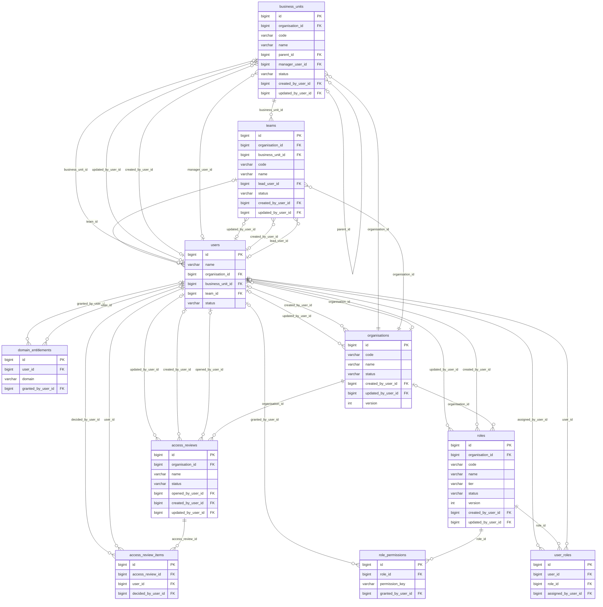
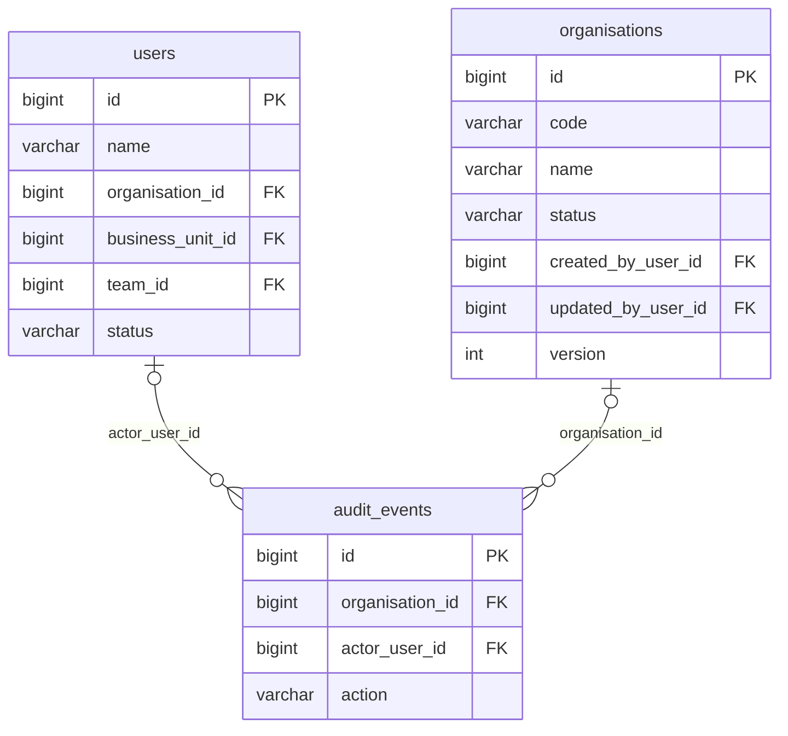
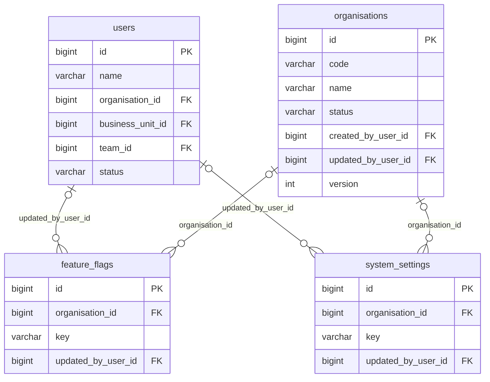
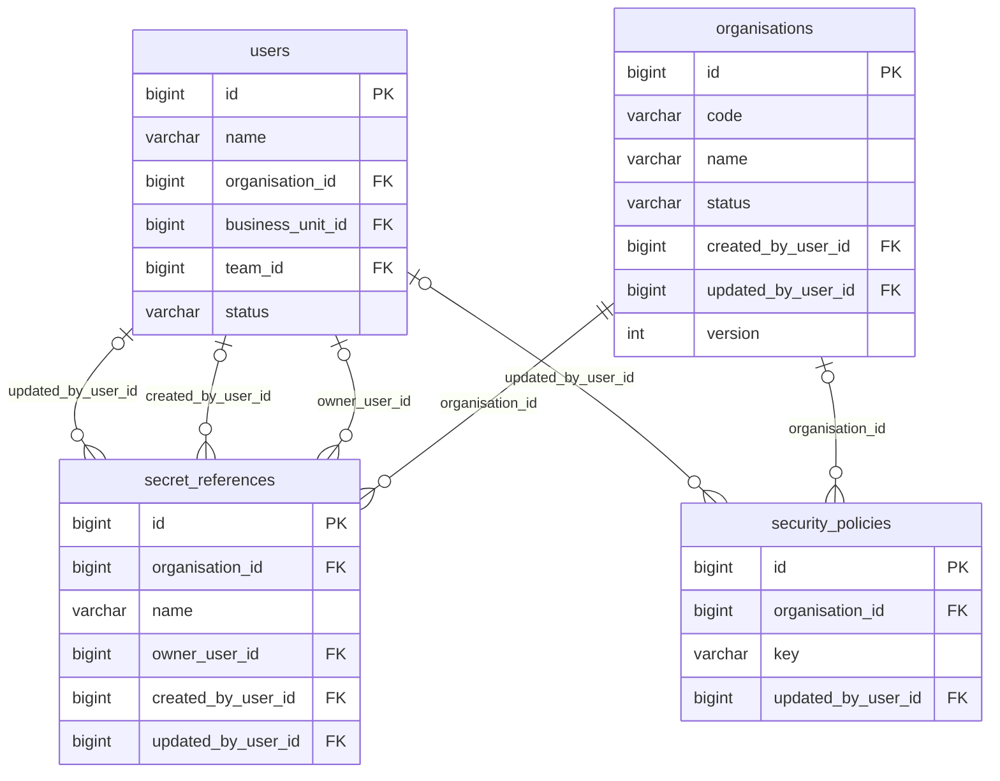

# SemantIQ Entity Relationship Model

**GENERATED. Do not edit this file by hand.**

Regenerate with:

```text
php tools/generate-data-docs.php
```

Every relationship below is a real foreign key read from the live database.
Nothing here is inferred from a column name.

Column-level detail is in [DATA_DICTIONARY.md](DATA_DICTIONARY.md).

Covers 31 tables, 382 columns, 83 foreign keys.

---

## How to read the diagrams

```text
PARENT ||--o{ CHILD    the child MUST have a parent
PARENT |o--o{ CHILD    the child MAY have a parent (the column is nullable)
```

One diagram per module. A single picture of 25 tables and 58 keys is a picture
nobody reads.

---

## 1. The shape of the whole thing

Two tables anchor everything else, and it is worth seeing that before any detail.

**`organisations` is the tenancy root.** Almost every table carries an
`organisation_id` pointing at it, and the `BelongsToOrganisation` global scope
turns that column into the boundary between one customer and the next. With no
organisation context resolved the scope matches nothing at all, which is why a
missing scope produces an empty screen rather than somebody else's data.

**`users` is referenced by almost everything, and is scoped differently.** It is
the one scoped table with no global organisation scope, because it is loaded by
id on every request and a fail-closed scope there would lock everybody out,
including whoever would fix it (SEC-DEC-022). Its tenancy is enforced
explicitly instead, on every read path and every mutation.

| Anchor | Foreign keys pointing at it | What that means |
|---|---|---|
| `organisations` | 18 | The tenancy boundary. Cascade on delete: removing a customer removes their data |
| `users` | 51 | Attribution. Almost all null on delete: the record survives the person |

---

## 2. Identity



| From | Column | To | On delete | Why |
|---|---|---|---|---|
| `access_review_items` | `decided_by_user_id` | `users` | set null | Attribution. The record outlives the person |
| `access_review_items` | `user_id` | `users` | cascade | Points at a person |
| `access_review_items` | `access_review_id` | `access_reviews` | cascade | Ownership |
| `access_reviews` | `updated_by_user_id` | `users` | set null | Attribution. The record outlives the person |
| `access_reviews` | `created_by_user_id` | `users` | set null | Attribution. The record outlives the person |
| `access_reviews` | `opened_by_user_id` | `users` | set null | Attribution. The record outlives the person |
| `access_reviews` | `organisation_id` | `organisations` | cascade | Tenancy. Removing a customer removes their data |
| `business_units` | `updated_by_user_id` | `users` | set null | Attribution. The record outlives the person |
| `business_units` | `created_by_user_id` | `users` | set null | Attribution. The record outlives the person |
| `business_units` | `manager_user_id` | `users` | set null | Points at a person |
| `business_units` | `parent_id` | `business_units` | set null | Self-referencing |
| `business_units` | `organisation_id` | `organisations` | cascade | Tenancy. Removing a customer removes their data |
| `domain_entitlements` | `granted_by_user_id` | `users` | set null | Attribution. The record outlives the person |
| `domain_entitlements` | `user_id` | `users` | cascade | Points at a person |
| `organisations` | `updated_by_user_id` | `users` | set null | Attribution. The record outlives the person |
| `organisations` | `created_by_user_id` | `users` | set null | Attribution. The record outlives the person |
| `role_permissions` | `granted_by_user_id` | `users` | set null | Attribution. The record outlives the person |
| `role_permissions` | `role_id` | `roles` | cascade | Ownership |
| `roles` | `updated_by_user_id` | `users` | set null | Attribution. The record outlives the person |
| `roles` | `created_by_user_id` | `users` | set null | Attribution. The record outlives the person |
| `roles` | `organisation_id` | `organisations` | cascade | Tenancy. Removing a customer removes their data |
| `teams` | `updated_by_user_id` | `users` | set null | Attribution. The record outlives the person |
| `teams` | `created_by_user_id` | `users` | set null | Attribution. The record outlives the person |
| `teams` | `lead_user_id` | `users` | set null | Points at a person |
| `teams` | `business_unit_id` | `business_units` | restrict | Ownership |
| `teams` | `organisation_id` | `organisations` | cascade | Tenancy. Removing a customer removes their data |
| `user_roles` | `assigned_by_user_id` | `users` | set null | Attribution. The record outlives the person |
| `user_roles` | `role_id` | `roles` | cascade | Ownership |
| `user_roles` | `user_id` | `users` | cascade | Points at a person |
| `users` | `team_id` | `teams` | set null | Ownership |
| `users` | `business_unit_id` | `business_units` | set null | Ownership |
| `users` | `organisation_id` | `organisations` | set null | Tenancy. Removing a customer removes their data |

**The two access dimensions are two different tables, and that is the point.**
`user_roles` says what somebody may DO in the platform. `domain_entitlements`
says which business data they may SEE. ROLE_MODEL.md section 1 is explicit that
a platform role never implies business data, and keeping them apart is how the
schema enforces it: a System Administrator with no `domain_entitlements` row
reads no Finance figure.

**There is no `permissions` table.** `role_permissions.permission_key` holds a
string validated against a catalogue in CODE. A permission an administrator
could invent would be a permission nothing checks (SEC-DEC-028).

---

## 3. Audit



| From | Column | To | On delete | Why |
|---|---|---|---|---|
| `audit_events` | `actor_user_id` | `users` | set null | Points at a person |
| `audit_events` | `organisation_id` | `organisations` | set null | Tenancy. Removing a customer removes their data |

**`audit_events` has no foreign key to anything it describes**, and that is
deliberate. `resource_type` and `resource_id` are loose columns, so the trail
survives the thing it describes being deleted - which is exactly when the trail
matters most. `actor_label` captures the actor as text for the same reason.

The table is **append only, enforced by two database triggers**. Model hooks
throw as well, but they do not fire on a mass delete, and MySQL has no DENY
(SEC-DEC-037).

---

## 4. Platform



| From | Column | To | On delete | Why |
|---|---|---|---|---|
| `feature_flags` | `updated_by_user_id` | `users` | set null | Attribution. The record outlives the person |
| `feature_flags` | `organisation_id` | `organisations` | cascade | Tenancy. Removing a customer removes their data |
| `system_settings` | `updated_by_user_id` | `users` | set null | Attribution. The record outlives the person |
| `system_settings` | `organisation_id` | `organisations` | cascade | Tenancy. Removing a customer removes their data |

Both tables are OVERRIDE stores. A key with no row reads its catalogue default, so a fresh install needs no seeder and a key nobody has touched cannot
drift.

---

## 5. Security



| From | Column | To | On delete | Why |
|---|---|---|---|---|
| `secret_references` | `updated_by_user_id` | `users` | set null | Attribution. The record outlives the person |
| `secret_references` | `created_by_user_id` | `users` | set null | Attribution. The record outlives the person |
| `secret_references` | `owner_user_id` | `users` | set null | Points at a person |
| `secret_references` | `organisation_id` | `organisations` | cascade | Tenancy. Removing a customer removes their data |
| `security_policies` | `updated_by_user_id` | `users` | set null | Attribution. The record outlives the person |
| `security_policies` | `organisation_id` | `organisations` | cascade | Tenancy. Removing a customer removes their data |

`security_policies` is an override store like the Platform pair.
`secret_references` is a register - and it holds no secret. There is no column
that could: the model refuses a credential-shaped string and the form request
refuses one before that.

---

## 6. Governance

```mermaid
erDiagram
    data_protection_profiles {
        bigint id PK
        bigint organisation_id FK
        int version
        varchar status
        bigint approved_by_user_id FK
        bigint superseded_by_id FK
        bigint created_by_user_id FK
        bigint updated_by_user_id FK
    }
    data_sovereignty_profiles {
        bigint id PK
        bigint organisation_id FK
        int version
        varchar status
        bigint approved_by_user_id FK
        bigint superseded_by_id FK
        bigint created_by_user_id FK
        bigint updated_by_user_id FK
    }
    personal_data_categories {
        bigint id PK
        bigint organisation_id FK
        varchar code
        varchar name
        varchar status
        bigint created_by_user_id FK
        bigint updated_by_user_id FK
    }
    privacy_correction_notes {
        bigint id PK
        bigint organisation_id FK
        bigint privacy_request_id FK
        bigint audit_event_id FK
        bigint decided_by_user_id FK
        bigint created_by_user_id FK
    }
    privacy_request_records {
        bigint id PK
        bigint organisation_id FK
        bigint privacy_request_id FK
    }
    privacy_requests {
        bigint id PK
        bigint organisation_id FK
        varchar status
        bigint subject_user_id FK
        bigint identity_verified_by_user_id FK
        bigint reviewed_by_user_id FK
        bigint released_by_user_id FK
        bigint created_by_user_id FK
        bigint updated_by_user_id FK
    }
    retention_policies {
        bigint id PK
        bigint organisation_id FK
        bigint personal_data_category_id FK
        varchar status
        bigint approved_by_user_id FK
        bigint created_by_user_id FK
        bigint updated_by_user_id FK
    }
    sovereignty_exceptions {
        bigint id PK
        bigint organisation_id FK
        bigint data_sovereignty_profile_id FK
        varchar status
        bigint requested_by_user_id FK
        bigint decided_by_user_id FK
        bigint revoked_by_user_id FK
        bigint created_by_user_id FK
        bigint updated_by_user_id FK
    }
    users {
        bigint id PK
        varchar name
        bigint organisation_id FK
        bigint business_unit_id FK
        bigint team_id FK
        varchar status
    }
    organisations {
        bigint id PK
        varchar code
        varchar name
        varchar status
        bigint created_by_user_id FK
        bigint updated_by_user_id FK
        int version
    }
    audit_events {
        bigint id PK
        bigint organisation_id FK
        bigint actor_user_id FK
        varchar action
    }
    users |o--o{ data_protection_profiles : "updated_by_user_id"
    users |o--o{ data_protection_profiles : "created_by_user_id"
    data_protection_profiles |o--o{ data_protection_profiles : "superseded_by_id"
    users |o--o{ data_protection_profiles : "approved_by_user_id"
    organisations ||--o{ data_protection_profiles : "organisation_id"
    users |o--o{ data_sovereignty_profiles : "updated_by_user_id"
    users |o--o{ data_sovereignty_profiles : "created_by_user_id"
    data_sovereignty_profiles |o--o{ data_sovereignty_profiles : "superseded_by_id"
    users |o--o{ data_sovereignty_profiles : "approved_by_user_id"
    organisations ||--o{ data_sovereignty_profiles : "organisation_id"
    users |o--o{ personal_data_categories : "updated_by_user_id"
    users |o--o{ personal_data_categories : "created_by_user_id"
    organisations ||--o{ personal_data_categories : "organisation_id"
    users |o--o{ privacy_correction_notes : "created_by_user_id"
    users |o--o{ privacy_correction_notes : "decided_by_user_id"
    audit_events |o--o{ privacy_correction_notes : "audit_event_id"
    privacy_requests ||--o{ privacy_correction_notes : "privacy_request_id"
    organisations ||--o{ privacy_correction_notes : "organisation_id"
    privacy_requests ||--o{ privacy_request_records : "privacy_request_id"
    organisations ||--o{ privacy_request_records : "organisation_id"
    users |o--o{ privacy_requests : "updated_by_user_id"
    users |o--o{ privacy_requests : "created_by_user_id"
    users |o--o{ privacy_requests : "released_by_user_id"
    users |o--o{ privacy_requests : "reviewed_by_user_id"
    users |o--o{ privacy_requests : "identity_verified_by_user_id"
    users |o--o{ privacy_requests : "subject_user_id"
    organisations ||--o{ privacy_requests : "organisation_id"
    users |o--o{ retention_policies : "updated_by_user_id"
    users |o--o{ retention_policies : "created_by_user_id"
    users |o--o{ retention_policies : "approved_by_user_id"
    personal_data_categories ||--o{ retention_policies : "personal_data_category_id"
    organisations ||--o{ retention_policies : "organisation_id"
    users |o--o{ sovereignty_exceptions : "updated_by_user_id"
    users |o--o{ sovereignty_exceptions : "created_by_user_id"
    users |o--o{ sovereignty_exceptions : "revoked_by_user_id"
    users |o--o{ sovereignty_exceptions : "decided_by_user_id"
    users |o--o{ sovereignty_exceptions : "requested_by_user_id"
    data_sovereignty_profiles |o--o{ sovereignty_exceptions : "data_sovereignty_profile_id"
    organisations ||--o{ sovereignty_exceptions : "organisation_id"
```



| From | Column | To | On delete | Why |
|---|---|---|---|---|
| `data_protection_profiles` | `updated_by_user_id` | `users` | set null | Attribution. The record outlives the person |
| `data_protection_profiles` | `created_by_user_id` | `users` | set null | Attribution. The record outlives the person |
| `data_protection_profiles` | `superseded_by_id` | `data_protection_profiles` | set null | Self-referencing |
| `data_protection_profiles` | `approved_by_user_id` | `users` | set null | Attribution. The record outlives the person |
| `data_protection_profiles` | `organisation_id` | `organisations` | cascade | Tenancy. Removing a customer removes their data |
| `data_sovereignty_profiles` | `updated_by_user_id` | `users` | set null | Attribution. The record outlives the person |
| `data_sovereignty_profiles` | `created_by_user_id` | `users` | set null | Attribution. The record outlives the person |
| `data_sovereignty_profiles` | `superseded_by_id` | `data_sovereignty_profiles` | set null | Self-referencing |
| `data_sovereignty_profiles` | `approved_by_user_id` | `users` | set null | Attribution. The record outlives the person |
| `data_sovereignty_profiles` | `organisation_id` | `organisations` | cascade | Tenancy. Removing a customer removes their data |
| `personal_data_categories` | `updated_by_user_id` | `users` | set null | Attribution. The record outlives the person |
| `personal_data_categories` | `created_by_user_id` | `users` | set null | Attribution. The record outlives the person |
| `personal_data_categories` | `organisation_id` | `organisations` | cascade | Tenancy. Removing a customer removes their data |
| `privacy_correction_notes` | `created_by_user_id` | `users` | set null | Attribution. The record outlives the person |
| `privacy_correction_notes` | `decided_by_user_id` | `users` | set null | Attribution. The record outlives the person |
| `privacy_correction_notes` | `audit_event_id` | `audit_events` | restrict | Ownership |
| `privacy_correction_notes` | `privacy_request_id` | `privacy_requests` | cascade | Ownership |
| `privacy_correction_notes` | `organisation_id` | `organisations` | cascade | Tenancy. Removing a customer removes their data |
| `privacy_request_records` | `privacy_request_id` | `privacy_requests` | cascade | Ownership |
| `privacy_request_records` | `organisation_id` | `organisations` | cascade | Tenancy. Removing a customer removes their data |
| `privacy_requests` | `updated_by_user_id` | `users` | set null | Attribution. The record outlives the person |
| `privacy_requests` | `created_by_user_id` | `users` | set null | Attribution. The record outlives the person |
| `privacy_requests` | `released_by_user_id` | `users` | set null | Attribution. The record outlives the person |
| `privacy_requests` | `reviewed_by_user_id` | `users` | set null | Attribution. The record outlives the person |
| `privacy_requests` | `identity_verified_by_user_id` | `users` | set null | Attribution. The record outlives the person |
| `privacy_requests` | `subject_user_id` | `users` | set null | Points at a person |
| `privacy_requests` | `organisation_id` | `organisations` | cascade | Tenancy. Removing a customer removes their data |
| `retention_policies` | `updated_by_user_id` | `users` | set null | Attribution. The record outlives the person |
| `retention_policies` | `created_by_user_id` | `users` | set null | Attribution. The record outlives the person |
| `retention_policies` | `approved_by_user_id` | `users` | set null | Attribution. The record outlives the person |
| `retention_policies` | `personal_data_category_id` | `personal_data_categories` | cascade | Ownership |
| `retention_policies` | `organisation_id` | `organisations` | cascade | Tenancy. Removing a customer removes their data |
| `sovereignty_exceptions` | `updated_by_user_id` | `users` | set null | Attribution. The record outlives the person |
| `sovereignty_exceptions` | `created_by_user_id` | `users` | set null | Attribution. The record outlives the person |
| `sovereignty_exceptions` | `revoked_by_user_id` | `users` | set null | Attribution. The record outlives the person |
| `sovereignty_exceptions` | `decided_by_user_id` | `users` | set null | Attribution. The record outlives the person |
| `sovereignty_exceptions` | `requested_by_user_id` | `users` | set null | Attribution. The record outlives the person |
| `sovereignty_exceptions` | `data_sovereignty_profile_id` | `data_sovereignty_profiles` | set null | Ownership |
| `sovereignty_exceptions` | `organisation_id` | `organisations` | cascade | Tenancy. Removing a customer removes their data |

**The two profile tables are VERSION tables, not settings tables.**
`superseded_by_id` is self-referencing: version 2 points back at the version 1
it replaced, so "what was in force in March" stays answerable. An approved row
refuses every update except that supersession (SEC-DEC-065).

`personal_data_categories.source_tables` is a JSON list of table names rather
than a foreign key, because it points at TABLES rather than rows. It is the
input to the R1.4c collector coverage test.

---

## 7. Every foreign key

All 83 of them, read from the live database.

| From | Column | To | On delete |
|---|---|---|---|
| `access_review_items` | `access_review_id` | `access_reviews` | cascade |
| `access_review_items` | `decided_by_user_id` | `users` | set null |
| `access_review_items` | `user_id` | `users` | cascade |
| `access_reviews` | `created_by_user_id` | `users` | set null |
| `access_reviews` | `opened_by_user_id` | `users` | set null |
| `access_reviews` | `organisation_id` | `organisations` | cascade |
| `access_reviews` | `updated_by_user_id` | `users` | set null |
| `audit_events` | `actor_user_id` | `users` | set null |
| `audit_events` | `organisation_id` | `organisations` | set null |
| `business_units` | `created_by_user_id` | `users` | set null |
| `business_units` | `manager_user_id` | `users` | set null |
| `business_units` | `organisation_id` | `organisations` | cascade |
| `business_units` | `parent_id` | `business_units` | set null |
| `business_units` | `updated_by_user_id` | `users` | set null |
| `data_protection_profiles` | `approved_by_user_id` | `users` | set null |
| `data_protection_profiles` | `created_by_user_id` | `users` | set null |
| `data_protection_profiles` | `organisation_id` | `organisations` | cascade |
| `data_protection_profiles` | `superseded_by_id` | `data_protection_profiles` | set null |
| `data_protection_profiles` | `updated_by_user_id` | `users` | set null |
| `data_sovereignty_profiles` | `approved_by_user_id` | `users` | set null |
| `data_sovereignty_profiles` | `created_by_user_id` | `users` | set null |
| `data_sovereignty_profiles` | `organisation_id` | `organisations` | cascade |
| `data_sovereignty_profiles` | `superseded_by_id` | `data_sovereignty_profiles` | set null |
| `data_sovereignty_profiles` | `updated_by_user_id` | `users` | set null |
| `domain_entitlements` | `granted_by_user_id` | `users` | set null |
| `domain_entitlements` | `user_id` | `users` | cascade |
| `feature_flags` | `organisation_id` | `organisations` | cascade |
| `feature_flags` | `updated_by_user_id` | `users` | set null |
| `organisations` | `created_by_user_id` | `users` | set null |
| `organisations` | `updated_by_user_id` | `users` | set null |
| `personal_data_categories` | `created_by_user_id` | `users` | set null |
| `personal_data_categories` | `organisation_id` | `organisations` | cascade |
| `personal_data_categories` | `updated_by_user_id` | `users` | set null |
| `privacy_correction_notes` | `audit_event_id` | `audit_events` | restrict |
| `privacy_correction_notes` | `created_by_user_id` | `users` | set null |
| `privacy_correction_notes` | `decided_by_user_id` | `users` | set null |
| `privacy_correction_notes` | `organisation_id` | `organisations` | cascade |
| `privacy_correction_notes` | `privacy_request_id` | `privacy_requests` | cascade |
| `privacy_request_records` | `organisation_id` | `organisations` | cascade |
| `privacy_request_records` | `privacy_request_id` | `privacy_requests` | cascade |
| `privacy_requests` | `created_by_user_id` | `users` | set null |
| `privacy_requests` | `identity_verified_by_user_id` | `users` | set null |
| `privacy_requests` | `organisation_id` | `organisations` | cascade |
| `privacy_requests` | `released_by_user_id` | `users` | set null |
| `privacy_requests` | `reviewed_by_user_id` | `users` | set null |
| `privacy_requests` | `subject_user_id` | `users` | set null |
| `privacy_requests` | `updated_by_user_id` | `users` | set null |
| `retention_policies` | `approved_by_user_id` | `users` | set null |
| `retention_policies` | `created_by_user_id` | `users` | set null |
| `retention_policies` | `organisation_id` | `organisations` | cascade |
| `retention_policies` | `personal_data_category_id` | `personal_data_categories` | cascade |
| `retention_policies` | `updated_by_user_id` | `users` | set null |
| `role_permissions` | `granted_by_user_id` | `users` | set null |
| `role_permissions` | `role_id` | `roles` | cascade |
| `roles` | `created_by_user_id` | `users` | set null |
| `roles` | `organisation_id` | `organisations` | cascade |
| `roles` | `updated_by_user_id` | `users` | set null |
| `secret_references` | `created_by_user_id` | `users` | set null |
| `secret_references` | `organisation_id` | `organisations` | cascade |
| `secret_references` | `owner_user_id` | `users` | set null |
| `secret_references` | `updated_by_user_id` | `users` | set null |
| `security_policies` | `organisation_id` | `organisations` | cascade |
| `security_policies` | `updated_by_user_id` | `users` | set null |
| `sovereignty_exceptions` | `created_by_user_id` | `users` | set null |
| `sovereignty_exceptions` | `data_sovereignty_profile_id` | `data_sovereignty_profiles` | set null |
| `sovereignty_exceptions` | `decided_by_user_id` | `users` | set null |
| `sovereignty_exceptions` | `organisation_id` | `organisations` | cascade |
| `sovereignty_exceptions` | `requested_by_user_id` | `users` | set null |
| `sovereignty_exceptions` | `revoked_by_user_id` | `users` | set null |
| `sovereignty_exceptions` | `updated_by_user_id` | `users` | set null |
| `system_settings` | `organisation_id` | `organisations` | cascade |
| `system_settings` | `updated_by_user_id` | `users` | set null |
| `teams` | `business_unit_id` | `business_units` | restrict |
| `teams` | `created_by_user_id` | `users` | set null |
| `teams` | `lead_user_id` | `users` | set null |
| `teams` | `organisation_id` | `organisations` | cascade |
| `teams` | `updated_by_user_id` | `users` | set null |
| `user_roles` | `assigned_by_user_id` | `users` | set null |
| `user_roles` | `role_id` | `roles` | cascade |
| `user_roles` | `user_id` | `users` | cascade |
| `users` | `business_unit_id` | `business_units` | set null |
| `users` | `organisation_id` | `organisations` | set null |
| `users` | `team_id` | `teams` | set null |

---

## 8. What is deliberately NOT a foreign key

Four references in this schema are not enforced by the database, each for a
stated reason. They are listed because an unenforced reference that nobody wrote
down looks like an oversight.

| Reference | Why it is not a foreign key |
|---|---|
| `audit_events.resource_type` + `resource_id` | The trail must survive the thing it describes being deleted. A foreign key would either block the delete or cascade away the evidence |
| `role_permissions.permission_key` | There is no `permissions` table. The catalogue is code, so that a permission cannot be invented in the database (SEC-DEC-028) |
| `system_settings.key`, `feature_flags.key`, `security_policies.key` | Same reasoning. The catalogue decides which keys exist; the table holds overrides only |
| `personal_data_categories.source_tables` | It points at TABLES, not rows. Validated by the R1.4c coverage test against the live schema instead |

